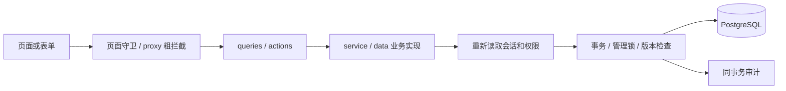

# 架构与代码地图

核对日期：2026-09-30；2026-10-01 按老板布局第一步更新「主要组件」与 lib/navigation-menu.ts 条目，未重核其他章节。本文件提供定位，不替代读取目标文件及 Next.js 本地文档。

## 技术栈与部署形态

- Next.js 16.3.4 App Router、React 19.2.8、TypeScript strict；Tailwind CSS v4 + shadcn/ui / Radix UI。
- PostgreSQL 16，本地与生产映射端口 5433；Prisma 7.10，@prisma/adapter-pg，客户端生成到 app/generated/prisma（不提交）。
- 单体应用：页面 + Server Actions + 服务层 + PostgreSQL；无独立 API 网关、消息队列或任务调度服务。
- 自建数据库 Session 与签名 httpOnly Cookie，bcryptjs 密码；不使用 JWT、第三方登录 SaaS。
- 输出 standalone，生产 Nginx → 127.0.0.1:3000 应用 → 127.0.0.1:5433 PostgreSQL。
- next.config.ts 限制单 worker，并配置 webpack 内存优化、Server Action 22mb 上传限制。不要随意删除小内存构建约束。
- Prisma 连接来自 prisma7.config.ts 的 DATABASE_URL，**不是 TEST_DATABASE_URL**。测试迁移必须显式换连接，详见开发规范。

## 请求和写操作路径

- 页面只组装数据和组件，不把业务授权留在浏览器。
- Server Action 解析输入、传递会话、调用事务、处理可展示错误、刷新或重定向。
- service/data 执行领域规则；查询也独立校验权限。不同模块现有文件拆分不完全一致，按原风格修改，不为统一格式做大重构。
- acquireUserMutationLock 是人员/账号交接/业务变更共享的事务管理锁；相关动作锁内重新检查操作者，阻止旧权限写入。
- version 乐观锁防旧表单覆盖。页面保存成功回显或 replace 导航；失败保留可继续编辑内容。
- writeAudit 使用同一事务客户端；不能直接独立写日志假装业务与审计原子一致。

## 路由地图

| 路由 | 作用 / 主要入口 |
| --- | --- |
| /login、/change-password、/ | 登录、强制改密、岗位首页路由 |
| /boss | 老板管理首页；公共管理侧栏 |
| /boss/users、/boss/users/new、/boss/users/[id] | 员工列表、新增、岗位与归属/密码/在职状态 |
| /boss/branches | 分公司与负责人 |
| /controller | 直播中控执行首页 |
| /wip | 其他岗位入口，不代表该岗位业务全部完成 |
| /accounts、/accounts/new、/accounts/[id]、/accounts/history | 账号档案、关联资料和历史 |
| /account-config、/account-config/[id] | 流程、话术、复制批量配置 |
| /workbench、/workbench/accounts/[id] | 工作台与账号场次准备/执行入口 |
| /workbench/sessions/[id] | 场次详情、执行/历史、更正 |
| /workbench/history、/workbench/shifts | 场次历史、上班历史 |
| /workbench/screenshots/[id] | 校验权限后读取截图文件，不是公开静态文件 |
| /leads、/leads/[id] | 认领池、待补、完成、回收站与场次填报 |
| /live-reports、/live-reports/new、/live-reports/[id] | 直播/打粉报表与历史录入；同一路由用 `?view=monetization` 切到打粉视图（老板侧栏与概览可直达），导粉关联记录转到导粉详情维护 |
| /resources/[kind]、/[id]、/new | anchors、rooms、numbers、phones、equipment、materials |

## 模块责任地图

| 代码位置 | 责任与修改提示 |
| --- | --- |
| lib/db.ts | Prisma 客户端入口；测试可创建指向隔离库的客户端 |
| lib/auth/session*.ts | 会话、Cookie 签名、读取当前用户；不要自行另做鉴权 |
| lib/auth/permissions.ts | 页面守卫、首页选择、老板人员/分公司管理能力 |
| lib/auth/roles.ts | userRoles / hasRole / roleWhere / rolesLabel，多岗位唯一共用入口 |
| lib/auth/account-permissions.ts | 老板、执行中控定义、账号维护与职责资格 |
| lib/auth/resource-permissions.ts | 直播间、号码、设备查询范围 |
| lib/auth/live-report-permissions.ts | 数据查看、负责人维护和专员/运营能力 |
| lib/auth/rate-limit.ts、lib/request-ip.ts | 登录限流与可信代理来源 |
| modules/auth | 登录、改密、会话撤销与认证事务 |
| modules/users | 岗位/在职/归属管理、管理锁、至少一名老板约束 |
| modules/branches | 分公司状态与查询；service.ts在管理锁内复核身份后增改启停并原子审计（09-29本地修复，09-30上线） |
| modules/accounts/service.ts | 当前/历史账号范围、账号保存、调拨、交接保护 |
| modules/accounts/data.ts | 列表、详情、候选和历史资料；含手机实际登录反查 |
| modules/resources/service.ts | 资源维护、手机号主副卡和双卡槽、单件化、实际登录账号 |
| modules/resources/data.ts | 资源详情、分类型列表、10/20/50 分页与可见关联 |
| modules/workbench/service.ts | 流程保存/复制、场次命令、工作空间和历史查询 |
| modules/workbench/shifts.ts | 上班、检查、时间更正与结束上班条件 |
| modules/workbench/corrections.ts | 已归档场次更正、人员/时间重叠验证 |
| modules/workbench/session-scripts.ts | 本场+账号话术同步，版本与事务保护 |
| modules/workbench/screenshots.ts | 图片校验、私有目录、关联、失败清理与读取权限 |
| modules/leads/service.ts | 场次认领、范围、草稿/完成、纠正归属、删除恢复、发布报表 |
| modules/live-reports | 传统报表查询与维护、打粉数据、回收站、历史兼容 |
| lib/audit.ts | 审计写入入口 |
| lib/datetime.ts | UTC / Asia/Shanghai 展示；具体表单解析还在报表 schema |
| lib/navigation-trail.ts | 安全站内来源路径、循环截断、列表参数保留 |
| lib/navigation-menu.ts | 管理侧栏分组/展示名与唯一选中、当前位置文案；不涉及权限 |

## 主要组件

- management-shell（服务端壳，算当前岗位可切换的工作台）+ management-shell-chrome（客户端侧栏/顶栏/抽屉/页面外框）、controller-shell、workspace-switcher：侧栏/顶部/岗位切换；菜单隐藏不是权限控制。
- lib/navigation-menu.ts：管理菜单分组、展示名与唯一选中/位置文案的唯一来源（纯函数，可单测）；lib/auth/workspaces.ts：岗位→可切换工作台的唯一来源，供顶栏切换菜单与 workspace-switcher 共用。
- context-link：关联跳转携带来源，ReturnLink 逐级返回，NavigationFields 隐藏保存来源，NavigationTrail 路径导航。
- workflow-editor、workflow-copy：三阶段事项、拖动/上下移动、秒数、口令/定时、话术与复制。
- workbench-home、work-shift-panel、work-session-view：上班、账号与本场主工作空间。
- work-task-row、work-action-form、work-time-input、work-live-clock：任务状态、实际时刻、提醒。
- work-scripts、work-corrections、work-task-correction、work-evidence-fields：话术、更正与截图。
- lead-form：认领及填报命令，草稿、完成和审计展示。
- resource-form、number-fields、number-directory、phone-directory、material-split-form：资源表单和对应列表。
- account-form、anchor-directory：账号人员维护和主播关联入口。
- live-report-form/table/details、monetization-form/table、report-recycle-form：旧报表及兼容入口。

## 导航约定（09-29 增加）

- 关联详情用 ContextLink，来源放 via 参数，内容为有长度/层数限制的站内 URL 数组。
- 来源包含列表筛选、页码、pageSize；编辑表单带 NavigationFields，服务端保存重定向保留安全 trail。
- 详情 ReturnLink 优先回前一级；没有 trail 则用模块默认列表。路径导航可跳回更早来源。
- 同页翻页/视图参数保持 trail；循环回到原详情会截断重复段。
- 拒绝外部地址、双斜线、反斜线、控制字符、不支持的命名空间，防止开放重定向。不要直接 trust formData.get('via')。
- 侧栏故意直接进入目标模块首页，不继承一串旧来源；浏览器原生后退与显式“返回”不是同一个功能。

## 特别容易误改的兼容机制

1. role + roles 合集，保留旧员工无需全量回填。
2. WorkSession 的 controllerId、loginUserId、actualControllerId 含义不同；不能相互覆盖。
3. AccountRecord 历史快照保护调拨后的数据归属。
4. JSON 流程旧字段 second/trigger 缺失有兼容默认；materials 保留不展示。
5. LeadTask 草稿与 LiveReport 正式指标是不同阶段，不能双向随意覆盖。
6. assets 的空成本与零成本、导粉的空白与零要区分。
7. 数据库部分唯一索引在 SQL 迁移，不都能从 Prisma schema 看出。修改并发规则必须读迁移。

## 2026-09-30 账号封禁

lib/account-status.ts统一账号列表、详情、历史及工作台的封禁日期显示；账号服务沿用管理锁和版本检查，写当前状态与历史。资源service.assignNumber调用账号服务时保留封禁和日期，不能从active=false推断为普通停用。工作台create/start在服务端再次拒绝封禁。到期不会自动启用，不新增定时任务。

## 2026-09-30 打粉数据入口

管理侧栏与老板概览直接链接/live-reports?view=monetization，ManagementShell结合pathname和view选择唯一活动入口；报表标题/来源名称匹配打粉视图。打粉表详情链接携带view=monetization。复用现有查询、筛选和权限，没有新路由/模型。

### 2026-10-01 管理框架交互修复

管理框架以data-management-shell标识实际布局，globals.css仅在该布局存在时隐藏根级global-workspace-switcher，其他岗位工作台保留全局切换。抽屉使用布尔状态，路由改变及进入桌面断点时关闭；不再绑定可被历史返回恢复的旧URL。分组由用户折叠，新路由展开对应组，面板保留hidden节点以保持aria-controls有效。岗位映射和服务端授权不变。

### D045中控页面与本人资料

/workbench/attendance复用WorkShiftPanel/getShift，WorkBenchHome不再嵌入设备检查和上下班表单；原workbench layout守卫继续生效。/controller/profile使用ControllerShell、ProfileForm及既有ChangePasswordForm。modules/profile分离schema/actions/service，本人字段白名单、共享管理锁、锁内会话复核、profileVersion和USER_UPDATE审计同时执行。账号可空中控的写入规范由saveAccount统一处理，手机号换绑复用该服务，避免null被写为空外键。

### D046检查清单与计时

WorkShiftPanel的ActiveShift保存服务端版本及检查快照；CheckRow保留各行本地草稿，完成勾选调用saveShiftCheckAction，busyRef同步阻止并行提交。事务内runShiftCommand沿用共享人员变更锁、会话复核、归属和version校验，保存后返回新版本/检查/首次完成时间，供下一项提交；过期版本拒绝，不能覆盖其他窗口的新结果。

页面用serverNow与performance.now展示时长，服务端以clockStartedAt（旧数据fallback createdAt）独立校验8小时。已保存检查与修改草稿分离；首次四项完成时间只在未结束记录首次由不足四项变为四项时写入。历史更正、原设备检查审计与会话守卫保留。

### D047直播工作首页

WorkbenchHome复用现有getWorkbench查询/作用域；去掉name入参及两处调用传参。账号卡片CSS grid桌面三列+独立滚动，执行岗位的非空待收尾区fixed底部并预留内容间距；其他管理岗位待办保持文档流。无新增客户端状态、查询或数据库字段。

### D048 账号三阶段执行

WorkSessionView按阶段组织所有操作，WorkTaskTable取代WorkTaskRow，以服务端保存快照/version串行互斥提交，失败保留原勾选状态。WorkWrapFields统一异常类型与证据，runWorkCommand在同一事务校验并收尾。截图写入失败仅记录错误码，前端保留输入。deploy/check-screenshot-storage.sh在激活前检查父目录访问权与应用用户读写，不递归改截图权限。

D049：workbench/schema集中定义五种endKinds和endOutcomes映射，isInterrupted/isViolationEnd/isOtherEnd共同用于保存、收尾、更正和状态展示；上传入口对非正常下播接受图片并由事务检查必填。避免只在前端增加选项。

## D050 老板记录管理
老板在/workbench/history使用管理列表，其他岗位保留原历史列表；/workbench/history/new补录，/workbench/sessions/[id]?edit=yes直达现有更正入口。管理服务modules/workbench/management.ts统一补录/回收站事务及老板权限；截图沿用私有上传与事务失败清理。WorkSession新增软删除过滤同步执行、更正、话术、截图、导粉、报表和上班查询。
老板/workbench/shifts显示简表，/workbench/shifts/[id]按需加载详情；原员工明细复用WorkShiftDetail，员工规则未变。ContextLink/ReturnLink保留来路及筛选分页。

## D051 统一填报与比率
modules/live-reports/input-metrics.ts集中中文时长解析、画像单位转换、四项打粉输入及八项公式定义；components/report-metric-sections.tsx供导粉表单与旧报表更正表单共用，历史字段使用只读折叠区。LeadTask服务端合并JSON、必填/兼容校验及原事务锁；报表表格按新口径计算，workbench查询和moneyPending同步去除隐藏指标待补条件。

## D052 确定数据与主播空间

`modules/settlements`包含共享日期/金额校验、老板CRUD、独立主播安全DTO及每日对比，写服务复用全局人员变更锁、事务内身份复核和版本审计。`/settlements`列表/新增/详情/回收站，`/settlements/backends`后端资料，`/settlements/comparison`按日主播对比，页面守卫及读写服务均限制老板。`/anchor`只返回本人数量/提成；纯主播登录重定向和多岗位切换共用岗位能力判断。

`modules/live-reports/personnel.ts`解析场次实际人员→历史快照，`date-range.ts`统一北京时间快捷日期。报表当前在权限过滤后解析历史人员及更正时间，再对全部匹配数据汇总/分页，避免当前账号人员替换历史。`modules/workbench/anchors.ts`统一本场主播选择与开播校验；老板主播更正复用原更正审计。导航来源白名单扩展settlements/anchor，保留筛选及分页。

D054：导粉表单状态用LeadTask.data.leadMode保存，提交事务同步LiveReport.isLeadGeneration；列表状态筛选/全量合计由live-reports/data统一处理，对比由settlements/comparison排除不导粉报告和草稿。旧独立报表沿monetization服务更正；状态变更沿用锁、版本和审计，无新增岗位权限。

## D055 新入口与授权（2026-10-02）
- /resources/external-anchors与modules/external-anchors：D061仅老板维护、全公司导粉选择的外部主播与多账号；公司账号表单不再新增外部关联；无独立员工登录。
- /leads/direct/new、/leads/direct/[id]与modules/direct-leads：独立任务建档/维护；复用LeadDataForm和指标校验；导粉列表合并分页；LiveReport用directTaskId唯一关联。
- lib/anchor-identity.ts区分内部/外部ID；reportPeople、报表筛选、确定数据和comparison同一标识；直接记录不依赖中控WorkSession。
- /boss/preview/[role]选择员工；/boss/preview/{role}/{employee}/view/{原路径}在proxy内部重写到原员工页。proxy拒绝未签名外来预览头，仅从专属路径生成签名上下文；内部重写再次经过proxy时只保留签名有效且路径匹配的上下文；真实老板会话不变。read-actor对每个读事务重新确认老板及目标员工，再应用原员工scope；普通写鉴权拒绝readonly-preview凭据，预览POST在proxy额外拒绝，截图落盘前再次写鉴权。
- WorkspacePreviewFrame显示固定只读身份，内部链接/GET筛选保持上下文并禁止业务表单；服务端保护不依赖前端禁用。previewHref保持服务器重定向上下文。不得把只读凭据传给客户端或写服务。

## D056 模块与代理
/boss/reporting与modules/reporting保存公司设置/直播数据，复用指标组件；WorkStageTabs按中控模式增加data标签。LeadTask写入严格分字段，仍锁内复核权限、版本和审计；SessionLiveData审计只含直播字段，可供中控查看。
预览重写使用原始request.url，next.config的skipProxyUrlNormalize=true保留回环origin；禁止用nextUrl规范化后的localhost代替127.0.0.1。Next将不同origin视为外部代理，HTTPS反代时会错误连接内部HTTP端口。该修复取代仅验证直连环境的假设；所有签名/读写鉴权保留。
WorkLiveClock使用中央Dialog；页面打开时定时和focus/visibility重新计算，localStorage按场次/事项去重，支持Web Locks时串行争取提醒，Notification由用户主动授权。只读预览显式禁用提醒。

## D057 首页查询（2026-10-03）
`readBossIncome`在服务端核验老板，读取ConfirmedLead未删除数据，使用现有日期、期间和整数分工具汇总后端收入；`/boss`复用SettlementFilters并同时显示主播与期间筛选。`readAccountList`从当前权限可见账号生成去重选项并组合过滤，返回链接沿用上下文导航。不变更写服务和数据结构。

## D059（2026-10-04）
新增只读确认路由 /leads/claim/[id]，getLeadClaim沿用可认领范围。leadAction增加release、correctActual和actualLeadId参数；runLeadCommand事务锁内验证人员/权限/版本，reportPeople统一解析实际人员，查询权限仍按userId。直接任务拒绝新认领命令。

## D060 配置导航（2026-10-04）
`lib/navigation-menu.ts`统一五组20入口，底部配置管理含/account-config、/boss/reporting、/settlements/backends；settlements匹配排除comparison和backends子树。`management-shell-chrome`共用桌面/抽屠菜单，过滤老板专属设置及后端入口；原路由、服务端鉴权和数据库结构不变。

## D061 资料列表与共享目录
外部账号继续复用DouyinAccount及AccountRecord，不新建重复账号实体。外部资料保存由modules/external-anchors事务统一维护多账号、版本、历史与审计；导粉新建任务从登录员工分公司保存归属，不从共享资料取归属。列表与新建执行/配置服务排除外部账号，历史读取保留。登录仅用户名受控状态，密码仍由表单重置清空。组织菜单21入口（内部/外部主播独立），外部入口仅老板。

## D062 班次与流程引导

schema.ts提供isShiftExpired，开始准备和确认开播在全局写锁内复核；shifts.ts实现shiftMissedEnd及补登记录更正的实际时间边界、版本/事务/审计。WorkShiftPanel及ShiftExpiryNotice提示超时而不显示时长，历史详情区分实际下班与操作时间。WorkStageTabs通过局部Context向WorkTaskTable提供纯导航，后者按成功保存的本地快照与pending/error控制按钮，未改服务端收尾门槛。导粉仅改展示名称及次要回收站样式，原查询参数/状态不变。

### D063 预览导航修复
员工选择页用完整文档导航进入预览，避免 Next 根布局缓存保留老板身份。根布局校验签名预览上下文后提供 PreviewNavigationProvider；ContextLink、ReturnLink 和路径导航在首次渲染即带预览前缀，防止裸链接预取丢失身份。服务端预览权限及写入拒绝沿用原实现。

### D064 场次名称（2026-10-06）
lib/session-label.ts统一场次名称的只读格式化，页面调用时传实际startedAt；关联报表沿用reportPeople已解析的场次更正时间。原始label/sessionLabel仍用于保存及审计，格式化值不回填表单。待收尾查询补选startedAt，不改变权限或状态。
