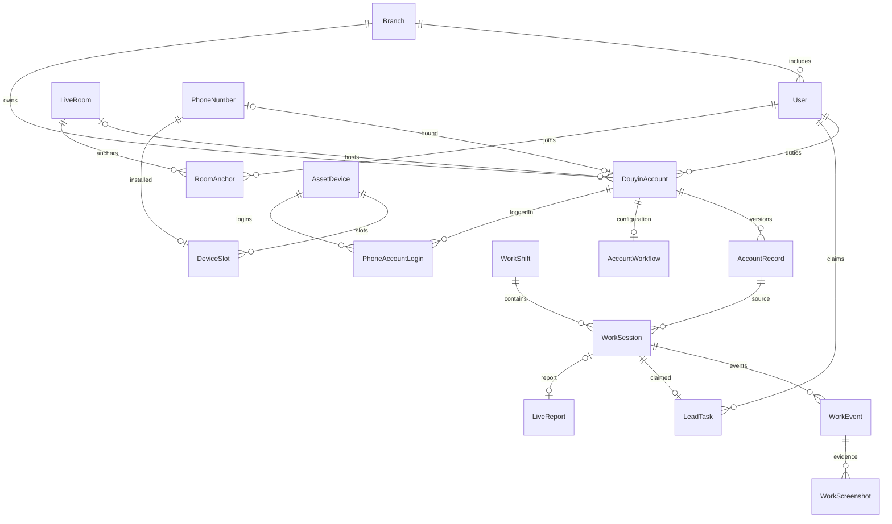

# 数据模型、关系与迁移

核对：2026-09-30；精确字段和约束以 prisma/schema.prisma 及 prisma/migrations 为准。当前 20 个 model，21 次迁移。不将业务表数量当成生产记录数量。

逐字段定义另见 [数据字段速查](data-dictionary.md)。

## 核心关系

图只展示主关系；分公司外键、操作者审计、主副卡和资产来源另见下表。某些历史身份为字符串快照而非外键，不要从图推断可自动级联重写。

## 20 张表的职责

| Model | 主信息 | 历史/约束注意 |
| --- | --- | --- |
| Branch | 名称、状态、managerId | 名称唯一；负责人关联 User，可空；分公司维护限老板 |
| User | username/name、passwordHash、role、roles、branchId、在职/强制改密 | username 唯一；保留 role，roles 为兼任数组；离职不删除 |
| Session | 随机 token id、userId、expiresAt | 数据库会话；不是平台 Cookie；敏感，不输出日志/文档 |
| AuditLog | actorId、action、targetType/id、detail、ip、时间 | detail JSON 保存前后值/原因；系统动作 actor 可空；不含明文密码 |
| DouyinAccount | 平台账号资料、分公司、运营/中控/主播、phoneNumberId、roomId、version | 抖音号唯一；中控可空；phoneNumberId 唯一；当前资料可更改 |
| AccountRecord | 账号每版人员/公司/名称快照、起止时间 | accountId+version 唯一；不留实名/号码等敏感资料；用于历史范围 |
| AccountWorkflow | accountId、content JSON、version、修改人 | 一个账号一份当前流程；场次复制为独立快照 |
| WorkSession | 账号/来源版本、三类中控身份、shiftId、阶段/结果、流程/进度 JSON、实际起止、version | 本场记录不等于报表；leadEligible 控制新旧认领兼容 |
| WorkEvent | sessionId、kind/body、actorId/name、时间 | 过程日志；截图与事件关联；历史完整保留 |
| DailyWork | userId+day、checks JSON | 旧日常检查兼容表，不能代替新 WorkShift 的跨日上班 |
| WorkShift | 登录人/名字、branchId、起止、checks JSON、version | 跨日不重置；用户每次上班关联多场 |
| WorkScreenshot | id、branchId、sessionId、eventId、mime、size、时间 | 文件另存私有目录；DB 与文件须成套备份 |
| LeadTask | sessionId、branchId、认领人/名、data JSON、完成/删除时间、version | sessionId 唯一，一场一专员；草稿字符串保存空与零差异 |
| LiveReport | 账号/历史来源快照、逐场直播与打粉指标、软删除、version | accountId+startedAt 唯一；workSessionId 可空且唯一；兼容旧独立录入 |
| LiveRoom | 名称、分公司、运营/中控、位置、备注、状态、version | branchId+name 唯一；关联多个账号与多个主播 |
| RoomAnchor | roomId、userId、branchId | 复合主键 roomId+userId，主播员工和直播间多对多 |
| PhoneNumber | 号码、开户人、多平台文本、套餐、主副卡/状态、人员/位置 | number 唯一；自关联 mainCardId；号码与卡槽一对零或一 |
| AssetDevice | kind、code、model、类别/序列号、数量/成本/估值、归属、拆分来源、登录微信 | code 唯一；PHONE/EQUIPMENT/MATERIAL 共表；手机数量1 |
| DeviceSlot | deviceId、slot、phoneNumberId、branchId | 主键 deviceId+slot；phoneNumberId 唯一；槽1/2 由服务校验 |
| PhoneAccountLogin | deviceId、accountId、branchId | 主键 deviceId+accountId；多手机多账号关系，独立于 SIM |

### 分公司字段的实际情况

“业务归属需要分公司隔离”是规则，**不是所有现有表都有 branchId 列**：AccountWorkflow 通过账号、WorkSession/WorkEvent 通过来源记录/场次取范围；DailyWork 通过人员；Session/AuditLog 是认证/审计表。禁止为了遵守一句旧约定给所有历史表盲目补字段或回填。新增关系要说明数据来源与服务端范围，跨公司历史不要跟随当前账号重写。

## 身份与历史

- User.role 是兼容旧单岗位；有效身份使用 role+roles 合集，roles 为空不表示没有岗位。
- 分公司负责人由 Branch.managerId 表达，不新增分公司负责人枚举。
- WorkSession.controllerId 保留创建时账号绑定中控含义；loginUserId/name 是系统登录操作人；actualControllerId/name 是实际代控。新列旧数据可空。
- sourceRecordId 是发生时账号版本，不要改成“每次查账号最新版本”。
- 新导粉表 branchId 取场次 sourceRecord.branchId；调拨不改变认领数据所属公司。
- 旧报告 createdBy 与当场中控不是同义词。新报表由导粉专员创建，但 controllerName 仍来自原场次责任快照。

## JSON 契约

### AccountWorkflow.content / WorkSession.workflow

- before/live/after 三个数组，各最多40项；每项 title、detail、minute，加可选 second(0–59)、trigger(timed/manual)。
- 旧 second 缺失=0；旧 trigger 按既有定时逻辑处理。顺序即事项顺序，场次进度以阶段+索引关联。
- scripts 最多60条，category/title/body/scene；分类枚举在 modules/workbench/schema.ts。
- materials 旧文本保留，当前 UI 不允许管理。不能移除 schema 字段后使旧 JSON 解析失败。
- 新流程配置只影响以后创建的场次。特殊例外：场中话术保存同步当前场次 scripts 和账号 scripts，但不改其他场次。

### WorkSession.progress / WorkShift.checks

- progress 的值包含 status(done/issue/skip/pending)、note、actor、at；仅备注变更保持 at，更正状态另留原记录。
- checks 包含 computer/sound/picture/network；值为 normal/issue、note、at、actor。
- WorkSession.outcome 支持 UNSTARTED / INTERRUPTED 等结果，不是独立 phase；未正常开播的显示必须看 outcome，不能单靠 CANCELLED 文案。
- hasViolation、hasIncident 可空表示未确认，不自动解释为无异常；收尾校验由命令服务控制。

### LeadTask.data / AuditLog.detail

- LeadTask.data 的各指标是表单字符串；空串表示未统计，"0" 表示明确零。
- complete 才向 LiveReport 写类型化指标；完成后编辑继续保持完整，不能降为缺项。
- 审计 detail 各动作结构不同，不应拿单一 UI 展示协议解释全部历史日志。相关修改通常包含 before/after/changes/reason/version。

## 数值与时间

- 时间存 UTC，展示与表单使用 Asia/Shanghai，当前主要实际时间输入精度为分钟；流程提醒单独精确到秒。
- 更正未变的分钟值应保留原秒/毫秒，不无故改时间。时间重叠与未来时间校验在服务端。
- 手机月费、资产购入单价/估值用整数分；数量为整数；总值由有效数量×单价计算，空值不推算。
- **历史例外**：LiveReport.salesGmv 是 Decimal(14,2) 元，并非整数分。新导粉不填带货，保留旧值；不要为了统一规范自动乘100迁移。
- PhoneNumber.dataGb 为 Decimal(10,2)，单位 G；停留用 averageStayHundredths 整数，单位0.01分钟；时长总秒。
- 比率由原始值计算，不能同时保存另一个可编辑百分数字段。

## 软删除与单件化

- User 离职、账号/资源停用与“物理删除”不同；不能直接 delete 历史关联。
- LiveReport.deletedAt 隐藏整场；monetizationDeletedAt 是旧流程单独打粉删除标记；恢复整场不能擅自恢复此前单独删除的打粉。
- LeadTask.deletedAt 是新流程整场软删除，同步报告隐藏；认领、执行、审计保留，不能删除后重新抢认领。
- AssetDevice.sourceAssetId / splitAt / individual 保留批次→单件关系。拆分母批次归档不计入当前物资，子项一物一码；价格继承单价，不将总价复制给每件。

## SQL 迁移清单

| 迁移目录 | 内容 |
| --- | --- |
| 20260904190857_init | 人员/公司/会话/审计初始结构 |
| 20260905231433_add_user_role_index | 旧岗位查询索引 |
| 20260907020357_douyin_accounts | 账号、账号历史、公司负责人 |
| 20260908092552_live_reports | 逐场直播报告 |
| 20260908095536_live_monetization | 原变现/现打粉和带货历史指标 |
| 20260909093000_controller_workbench | 账号流程、场次、执行日志、旧日常检查、场次报表关联 |
| 20260910090000_rooms_and_resources | 直播间、主播关系、号码、设备、卡槽及账号关联 |
| 20260910100000_work_session_violation | 违规字段 |
| 20260913010000_asset_values | 数量与资产价值 |
| 20260913020000_individual_materials | 单件物资与来源批次 |
| 20260915020000_phone_number_details | 主副卡、套餐、多平台账号等 |
| 20260917010000_report_recycle | 报表软删除 |
| 20260925161313_work_shifts | 上班与本场人员、检查等基础 |
| 20260925163000_work_shift_identity | 上班/执行身份约束 |
| 20260925190512_work_evidence | 异常、截图与事件关系 |
| 20260927192208_lead_specialist | 导粉岗位、LeadTask、leadEligible 旧false/新true |
| 20260928150022_user_multi_roles | User.roles，旧员工为空数组 |
| 20260928171643_phone_login_accounts | 实际登录微信文本和手机/抖音多对多表 |
| 20260929130000_account_ban | 账号与账号历史的封禁标记、预计解封日期及一致性约束 |

并发部分唯一索引、检查约束以迁移 SQL 为准；禁止修改已应用迁移来“修正”线上状态。新增变更另开兼容迁移，在独立测试库核对旧列保持不变。

## 2026-09-30 账号封禁增量字段

DouyinAccount和AccountRecord均新增banned Boolean默认false、unbanDate可空String（YYYY-MM-DD日期，不做时区转换）。保留active旧字段：启用为true/false，停用为false/false，封禁为false/true。SQL约束禁止封禁且启用、非封禁带解封日期。服务校验日历日期；恢复或停用时清空当前日期，旧AccountRecord继续保留。迁移20260929130000_account_ban只追加字段/约束，迁移专项核对20张旧表原列不变。

## 2026-10-01 个人资料与账号中控可空

迁移20261001040000_controller_profile为User新增nickname/contactPhone（默认空字符串）、profileVersion（默认0）；不复用name，历史姓名不回写。DouyinAccount.controllerId及对应User关联改可空；AccountRecord/LiveReport的controllerId/controllerName职责快照改可空。WorkSession.controllerId仍必填，创建准备时明确拒绝未绑定中控账号；绑定、清空与换绑均继续产生账号历史。迁移不更新任何旧列数据，隔离演练核对20张原表全部原列一致。

### D046 WorkShift增量（迁移20261001070000_shift_checklist）

clockStartedAt为服务器开始计时点，checkedInAt为首次四项检查完成时间，earlyEndReason为提前结束原因；均可空以兼容旧行。新开始记录写clockStartedAt，员工更正不更新；旧未结束记录使用createdAt。checkedInAt只在活动班次首次完成全部检查时写入，后续重检不改变。旧已结束记录不补写，历史已完成但无确认时间明确显示未记录。现有checks JSON及审计保留。迁移只增加列，不改旧值。

### D048 三阶段与异常类型

WorkSession新增hasOtherIncident Boolean?，迁移20261001160000_work_stages（第22次）仅追加可空列，旧值保持null。hasIncident表示异常总开关，hasViolation/hasOtherIncident区分两类及并存；新收尾无异常写false。异常中断强制other=true。旧progress的note/issue/skip不删除，新执行check只写done/pending，取消后重勾更新时间；变更前后progress进入审计。旧归档不重判。WorkScreenshot复用本场end/violation附件作为收尾证据，新附件关联complete事件。

D049：WorkSession.outcome复用可空String，新值VIOLATION_STOP、VIOLATION_BAN、EQUIPMENT、OTHER_INTERRUPTION；NORMAL/UNSTARTED/INTERRUPTED保留。schema集中映射输入、显示和异常判定，无数据库迁移、不改旧记录。WorkEvent保存具体下播类型及原因；更正审计保留前后类型。

## D050 场次补录与回收站
WorkSession新增7个可空字段：supplementedAt、supplementedById、supplementedByName记录老板补录来源；occurredAt记录补录发生时间（未开播也有），不覆盖createdAt；deletedAt、deletedById、deleteReason记录当前回收站信息。操作者ID/名称为审计快照，不增加级联外键。迁移20261001190000_session_management只加列，旧行全部NULL，无数据回填。恢复清空删除字段，历史操作保留WorkEvent/AuditLog。空流程补录以workflowVersion=0标记未知，不推断历史配置。

## D051 导粉精简数据契约（2026-10-02）
迁移20261002010000_report_audience新增LiveReport.femaleHundredths、age31To40Hundredths两个可空Int，单位百分之一百分点（65.32%存6532），数据库CHECK 0–10000。所有旧记录保持NULL，不回填或推断。
LeadTask.data新增durationText、femalePercent、age31To40Percent字符串；提交完成首次标记formVersion=2。旧三段时长只用于回显合并，不覆盖旧键。合并JSON保留未知/历史字段；已完成旧版无formVersion可缺画像，已有画像不能清空。总秒数及其他原始人数存储不变，旧长按/带货列与审计保留。

## D052 数据契约

- WorkSession.actualAnchorId（可空User外键，Restrict）/actualAnchorName：本场实际主播及姓名快照。旧记录保留NULL，显示回退AccountRecord历史主播，不迁移猜测。
- LiveReport新增anchorName、leadUserId、leadUserName三个可空历史补正字段；原anchorId/controllerId不删除。有场次实际人员及LeadTask时优先读取关联事实；无对应关联时使用原报表人员和新补正快照。查询采用当前已更正场次开播时间，原报表startedAt/指标保持不改；旧报表表单使用originalStartedAt维护原记录。
- LeadBackend：id、唯一name、url、active、version、createdAt/updatedAt。仅老板操作；关联后可停用不可物理删。
- ConfirmedLead：day（YYYY-MM-DD北京时间业务日）、anchorId(User FK)/anchorName、backendId(FK)/backendName/backendUrl、joinCount/effectiveCount、backendUnitCents/anchorUnitCents（整数分）、version、deletedAt及创建更新时间。day+anchorId+backendId唯一，anchorId+day索引；数据库检查非负及有效≤加人。
- 总价/提成不另存易过期副本，按有效数量×整数分以BigInt运算，再输出两位小数字符串；单价最多7位整数元、数量上限20亿。
- 新增20261002030000_confirmed_leads、20261002031000_legacy_report_people迁移，原20张表全部原列保持不变；新增两模型后共22模型，不更新旧指标。

D053（2026-10-02）：后端url及确定数据backendUrl保留为历史兼容列，不迁移。新增写空字符串，更新保留旧值（包括改选后端）；业务页面不再填写/展示链接，历史审计不删除。

## D054 是否导粉

LiveReport新增isLeadGeneration Boolean?；true导粉、false不导粉、null历史未标记。迁移20261002080000_report_lead_mode仅添加可空列，不回填；共27迁移、22模型。LeadTask.data新增leadMode字符串：yes/no/空串，旧JSON缺键等同空；提交完成事务内同步报表。旧人数列/JSON/扩展字段保留，未导粉新报表的打粉人数为空。

## D055 兼容扩展（2026-10-02）
新增ExternalAnchor与DirectLeadTask，模型数24。ExternalAnchor关联分公司，无用户会话；版本与启用状态保护维护。DirectLeadTask独立保存账号/AccountRecord/分公司/外部主播ID及姓名快照、负责人ID及姓名、开播时间、场次标签、草稿JSON、完成/删除时间、版本；提交与LiveReport更新同事务。
DouyinAccount、AccountRecord、LiveReport、ConfirmedLead新增可空externalAnchorId；AccountRecord新增externalAnchorName快照，LiveReport复用anchorName；LiveReport新增唯一可空directTaskId，不能同时关联WorkSession。ConfirmedLead.anchorId改为可空，约束内部/外部恰好一种，增加日期+外部主播+后端唯一索引，原内部唯一索引保持。旧列/指标/快照不回填；旧关联不清空。
迁移20261002110000_external_direct_leads为第28个迁移；独立空临时库从旧结构升级，22张旧表原列摘要一致，含旧结算金额及后端链接，两张新表为空。正式尚未迁移。

D055生产已于2026-10-02完成第28次迁移；24个业务模型，22张原表原列摘要一致，无旧数据回填。
