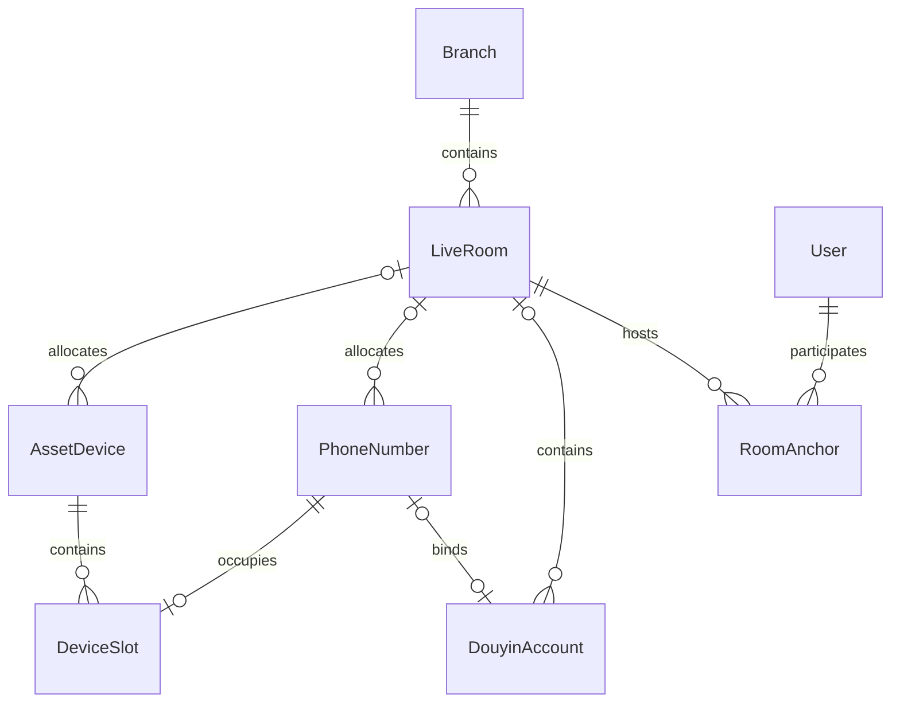

> 文档定位（2026-09-29整理）：本文含历次资源与工作台演进，旧段中的中控统计权限、素材、分钟级限制、固定10条分页不代表现状。当前规则见 [business-rules.md](business-rules.md)，关系见 [data-model.md](data-model.md)，最近进度见 [current-status.md](current-status.md)。

# 主播、直播间与物资管理

2026-09-09 用户确认：直播间可绑定多个抖音账号，每账号同时属于一个直播间；主播可关联多个直播间。物资所属分公司必填，直播间、运营、中控及使用人允许暂未分配。中控以电脑浏览器为主。

## 关系

- 主播管理复用 User 员工记录，展示姓名、分公司、在职状态及关联直播间/账号。新增入口预选主播岗位，账号创建与员工资料编辑沿用老板权限，不重复建立人员身份。
- LiveRoom 保存名称、位置、所属分公司、运营、中控、备注和状态；RoomAnchor 支持多名主播同时使用和主播跨直播间关联。账号原先单名主责主播保持不变，不因直播间成员变更自动改写账号负责人。
- PhoneNumber 保存手机号码、开户人、微信号、运营商、套餐、用途、使用人及备注，另有所属分公司、直播间、运营、中控。开户人不从抖音实名人自动推断。微信号目前为文字字段，不创建微信登录或自动操作功能。
- DouyinAccount.phoneNumberId 保存唯一绑定关系，账号表、号码详情和编辑页面共用。修改号码也同步账号展示；绑定变更更新相关号码版本，避免另一页面的旧表单覆盖关联。
- AssetDevice 分 PHONE、EQUIPMENT 两类，分别提供手机管理、设备管理入口。手机包含编号、型号、用途、使用人、备注、两个号码卡槽；设备包含编号、型号、类型（如电脑/摄像头/麦克风）、序列号、用途、使用人和备注。两类都保存完整归属字段。
- DeviceSlot 只允许 1、2 两个卡槽；phoneNumberId 全局唯一，数据库和服务端共同拒绝一号多机、双槽同号。号码必须先登记为本公司档案。

## 权限和一致性

- 老板跨公司管理；分公司负责人仅管理自己的分公司。员工只查看自己负责/使用或相关账号、直播间范围内的资料，关联详情按各实体权限重新筛选。
- 保存时复核会话、当前公司权限、人员岗位及在职状态；所有实体变更共用管理事务锁，版本冲突拒绝覆盖，审计同事务保存。
- 分公司不一致的房间、人员、号码、设备引用拒绝保存。跨公司调拨仅老板可操作；直播间仍有关联账号或物资时不能调拨/停用，号码跨公司前须先从原手机取出。
- 员工离职、调岗、调公司前，除原有账号交接外，也须完成直播间与物资使用/负责关系交接。
- 原有合法且唯一的账号手机号在增量迁移时建立档案并关联；重复或格式不完整的号码保留原文本，待人工建档核对。不删除原始号码文字和既有直播/变现记录。

## 中控页面

- 首页主区域为当前场次、账号和待办，右侧为常用资料，日常检查默认折叠。
- 使用明确列宽、可收缩主栏和换行规则；场次页以三阶段切换显示任务，话术在右侧固定区域查看，避免清单同时展开。
- 账号工作空间提供当前直播间和绑定手机号入口；新关联仅代表资料管理，不控制抖音、手机、SIM 卡或电脑。

## 验证

### 2026-09-13 物资与资产价值

后续小步更新：物资默认逐件建档，一次 1 至 100 件。多件以输入编号作为来源批次编号，生成 `原编号-001` 等独立物资，每件数量固定 1，编号不可变，归属可分别维护。耗材仍可选择按数量登记。

旧物资数量为 2 至 100 且启用时，可在详情核对编号后手动拆分。拆分和审计同事务提交，共用管理锁及版本校验；数量、购价总额、估值总额守恒，空值保持未知。原批次保留原字段，标记 splitAt、停用并只读，列表的“已拆分批次”查看，不重复计入现有物资；单件通过 sourceAssetId 外键追溯来源。序列号不批量复制，按实物补填。

归档批次不阻挡原使用人交接或原直播间停用，仍在用的单件继续受原约束。所有来源及单件链接分别校验查看范围，不因同批次扩大权限。上线迁移只加字段与约束，不自动拆分正式资料。

- 新增 `/resources/materials`，家具及小物件与手机、设备共用 AssetDevice 档案、权限、版本及审计；新增 MATERIAL 类别，不搬迁旧记录。
- 三类资产支持数量、单位、购入日期、购入单价及当前单件估值，列表与详情计算购入总额和估值总额。金额以整数分存储；未登记和 0 元分开显示。手机一机一档且数量只能为 1，其余资产同规格、单价与归属可按批登记。
- 分公司必填，直播间、运营、中控、使用人可空。沿用已有外键，直播间详情自动列出权限范围内的物资，物资详情可跳转直播间。手机与手机号、手机号与抖音账号保持原有关联，无重复维护字段。
- 仅老板和本公司负责人可维护；中控只能查看直接使用或负责的本公司物资，无新增、修改权限。资产仍通过停用保留记录，修改及调拨记录审计。
- 迁移只新增字段和枚举。旧资产数量、购价、估值保持空值，不推算或伪造；以后可逐步补齐。数量上限 1000000，单价上限 21474836.47 元，前后端和数据库分别校验。
- `deploy/verify-existing-data.mjs` 在应用停止写入期间快照并核对迁移前所有旧列的行数、内容摘要；摘要文件权限 600，不包含业务明文，禁止用快照替代数据库备份。

`npm run test:resources` 在隔离测试库验证关联、双卡槽、唯一占用并发、权限、版本、交接和事务回滚。可通过 RESOURCES_HTTP_BASE=本机测试服务地址验证真实页面渲染。原有账号、直播数据与工作台测试同时回归。

## 2026-09-10 管理端与中控流程分工

- 老板端统一顶部导航和左侧管理菜单，业务页面在右侧展示。
- `/account-config` 按账号配置三阶段流程、开播后分钟安排、素材及话术。仅老板、本分公司负责人和绑定运营可写流程；绑定中控仅能提交话术数组，服务端合并并保留原流程。
- 工作台账号页面展示流程，开始准备后进入独立场次执行。配置变更只影响新场次。
- 场次事项通过复选框记录完成与取消，服务器记录操作人及时间；备注单独保存不改变原完成时间。直播中展示开播后分钟/预计北京时间、工作内容、完成情况与时间、备注。
- 下播后记录是否违规及具体内容；有违规必填详情，未填写是否违规不能完成收尾。历史已完成场次保持“未记录”，不推断无违规。每次更改保留场次事件和审计。

## 中控执行空间与资料范围

- 中控使用统一侧边栏和顶部导航，入口为本人任务、本人直播/变现记录、本人场次及相关资料。
- 中控账号查询限定绑定中控本人；历史场次和报表保留本人当时负责的记录。其他中控的历史、新场次和资料不因共用直播间而开放。
- 中控手机号、手机、电脑设备只接受直接 controllerId 或 userId 分配，并限制同分公司。号码所在手机或共用直播间不再扩大查看范围。主播与直播间为本人负责账号/直播间的协作资料。
- 中控无账号及物资维护权限，服务端重新检查；流程不可编辑，话术仍可维护。
- 选择账号后展示清单预览，先开始本场准备建立场次，再勾选执行；存在进行中场次时直接进入。
- 场次页面在下播后嵌入直播和变现表单，保存后留在本页；先保存直播数据以建立报表，再补充变现数据。中控也可从首页、侧边栏或数据列表直接录入，数据详情可补填和更正本人记录，受既有服务端归属和版本校验约束。

## 2026-09-12 统一账号流程与批量配置

2026-09-13：主播列表与详情展示各关联抖音账号的运营、中控，并对老板及本公司负责人显示“修改该账号的运营 / 中控”入口，定位到账号现有编辑表单。继续使用账号负责人唯一关系、版本和历史审计，不新增与账号冲突的主播人员绑定表；负责人保存后刷新主播、账号和工作台页面。

- 选择账号后统一进入 `/workbench/accounts/[id]`。未开始时预览三个阶段，开始准备后使用同一路径的 sessionId 展示执行、违规及直播/变现填报；历史场次原链接继续可用。
- `/account-config` 列表和单账号配置页提供“复制配置 / 批量应用”，支持分别选择三个阶段、话术、素材。来源必须先保存，首次配置的目标必须包含三个阶段。
- 老板、本分公司负责人、绑定运营仅能复制有配置权限的来源及目标，中控不能复制流程。服务器重新检查权限、来源与全部目标版本；整批原子保存，冲突时不覆盖任何目标。
- 复制后各账号独立维护，只影响之后创建的场次，现有场次快照不变。隔离库覆盖权限、版本冲突、部分复制、批量回滚、独立编辑和快照保留；HTTP 验证统一账号入口和配置页面。

## 手机号管理完善（2026-09-15）

- 列表每页 10 条，显示手机号、开户人、使用人、正常/停机/注销状态，以及抖音、微信、小红书、快手绑定；按开户人、使用人、状态组合筛选，翻页保留筛选，筛选选项受当前用户权限约束。
- 运营商使用中国电信、中国联通、中国移动、网络卡四项。旧自定义运营商保留原值供核对，不自动改写；旧套餐文字保留。
- 月套餐费使用整数分，流量使用两位小数 Decimal（G）。主副卡关系为同公司一对多，自关联禁止嵌套和环；副卡从主卡读取套餐，不重复存储费用或流量。旧记录 cardType 留空显示待确认，不推断主副关系；原 active 为真/假分别显示正常/停机，旧字段不被迁移改写。
- 有所属副卡的主卡须先转移/解除副卡，才能改为副卡、跨公司调拨或注销。注销保留原号码与绑定记录，不物理删除。
- 所在手机复用 DeviceSlot 双卡槽；手机号页可选择已编号手机及卡槽，或“其他”并填写个人手机等说明。两种位置互斥，卡槽冲突拒绝覆盖。手机与号码任一端变更卡槽时更新另一端版本，阻止旧编辑页覆盖关联。
- 抖音绑定复用账号档案；微信、小红书和快手目前为账号文本，没有独立账号管理模块。各页面关联跳转遵循原有分公司及负责关系权限，中控仍只读。
- 增量迁移 `20260915020000_phone_number_details` 仅添加列、索引和约束；未批量修改原字段。`npm run test:numbers` 验证共享套餐、旧资料、双向卡槽和版本保护、分页筛选及权限；可通过 RESOURCES_HTTP_BASE 增加真实 HTTP 页面检查。

## 2026-09-29 管理导航与手机实际登录账号

- 资料关联链接记录安全的站内来源路径，详情可逐级返回或点击查看路径；返回列表和编辑保存保留原筛选、页码及每页条数。直接点击侧边栏仍进入对应模块首页。
- 手机号、手机列表默认每页 20 条，可选 10/20/50；服务端校验条数、页码并按稳定顺序分页。手机列表提供搜索、使用人、状态筛选，显示编号、信息、使用人、登录抖音号、登录微信号、安置的手机卡、状态。资产价格和估值保留在详情中。
- 手机实际登录账号独立登记：同公司抖音账号多选，微信号每行一个；与卡槽中的号码绑定账号分别存储，换卡不改登录记录。手机号、手机与抖音账号可双向查看关联，仍使用原有查看和修改权限。
- `PhoneAccountLogin` 保存手机与抖音账号多对多关系，`AssetDevice.loginWechats` 保存实际微信登录账号。跨公司调拨前须解除不兼容的登录关联；保存保留版本冲突保护及修改审计。
- 迁移 `20260928171643_phone_login_accounts` 只新增表和字段，旧手机显示未登记，不根据手机卡推断登录账号。隔离测试覆盖旧数据保留、关联、权限、调拨、审计及分页；浏览器验证逐级返回、保存来源与筛选分页。
